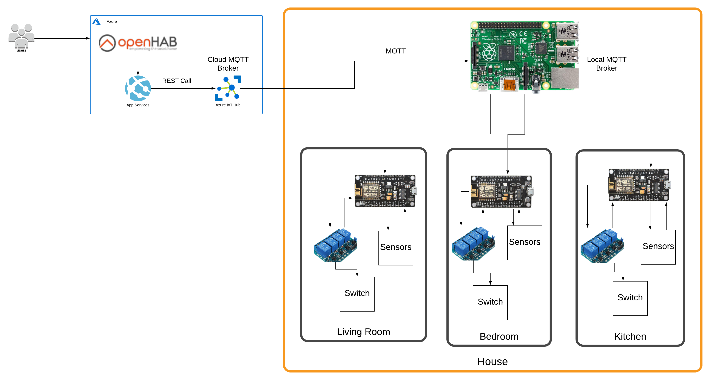

# Zapper 

## Smart Home Automation

Zapper is smart home automation solution for user who can freely automate the home according to their requirements, variable devices and fixed devices can be automated using zapper.The existing homes can be automated easily and cost effectively. We are trying to make it energy saving based smart home automation.Easy to use technology so anyone can easy install it and automate any home.

## Architecture 

## Technology Stack 

- OpenHAB
- Microsoft Azure 
	- App Services
	- Azure IOT Hub
- Raspberry PI
- NodeMCU
- Relay
- Sensors(Temperature,etc)

#### Protocols

- REST/HTTP
- Websockets over MQTT 

